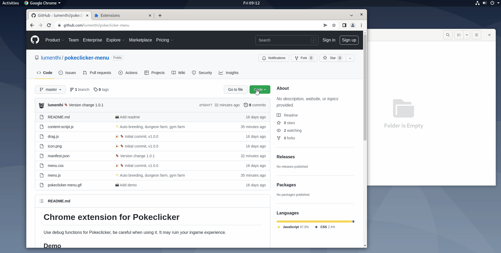

# Chrome extension for Pokeclicker
Pokeclicker menu with some QOL tools along with cheat/debug functions

## Installation

## Features
### Debug tools
Use debug functions from the game (cheating)
- **Currencies**
  - Give yourself 1 000 000 Pokedollars
  - Give yourself 100 000 Dungeon Tokens
  - Give yourself 2000 Quest points
  - Give yourself 50 Diamonds
- **Pokeballs**
  - Give yourself 100 Pokeballs
  - Give yourself 50 Ultraballs
  - Give yourself 1 Masterball
- **Features**
  - 1 Shot click, 1 shot every Pokemon
  - Shinies only, only shinies Pokemons in the wild
  - Always catch, 100% catchrate

### Quality of life tools
- **Autoclick**
  - 
